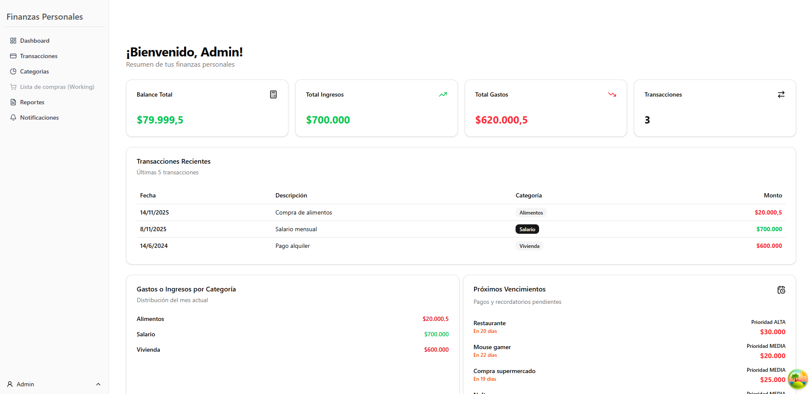

# Finanzas Personales - Frontend



---
#### Descripción general

Este repositorio contiene el código del frontend para el Sistema de Finanzas Personales. Es una aplicación web desarrollada con React y TypeScript diseñada para permitir a los usuarios gestionar sus ingresos, gastos, categorías y notificaciones de vencimientos de manera eficiente.

Este proyecto funciona como la interfaz de usuario para la siguiente [API REST](https://github.com/Bara1422/FinanzasPersonalesBack).

Para que funcione se deberan seguir las instrucciones de ambos repositorios y tenerlos corriendo en simultaneo

---

#### Características Principales

La aplicación cuenta con las siguientes funcionalidades:

- **Autenticación de Usuarios:** Registro e inicio de sesión seguro mediante
  tokens JWT.
- **Dashboard General:** Visualización resumen del balance total, ingresos,
  gastos, notificaciones pendientes y últimas transacciones.
- **Gestión de Transacciones:** Creación, edición, eliminación y listado de
  transacciones (ingresos y gastos) con filtros por tipo y categoría.
- **Categorización:** Visualización de gastos e ingresos agrupados por
  categorías.
- **Notificaciones y Vencimientos:** Sistema de alertas para gastos pendientes y
  fechas de vencimiento, con historial de pagos realizados.
- **Reportes:** Generación y descarga de reportes financieros en formatos PDF y
  Excel.
- **Gestión de Perfil:** Actualización de datos de usuario.

---

#### Tecnologías Utilizadas

El proyecto está construido utilizando:

- **Lenguaje:** TypeScript.
- **Biblioteca UI:** React.
- **Herramienta de compilación**: Vite.
- **Estado y Datos:** Zustand (gestión de estado global), TanStack Query
  (gestión de estado asíncrono y caché).
- **Estilos y UI:** Tailwind CSS, Shadcn/ui (componentes base), Lucide React
  (iconos).
- **Formularios y Validación:** React Hook Form, Zod.
- **Comunicación HTTP:** Axios.
- **Linting:** Biome.js (linter y formatter).

---

#### Requisitos Previos

[Node.js 18+](https://nodejs.org/es/download)
[Finanzas Personalez Backend](https://github.com/Bara1422/FinanzasPersonalesBack)
corriendo

---

#### Instalación

1. Clonar el repositorio

```bash
git clone https://github.com/Bara1422/FinanzasPersonalesFront.git
cd FinanzasPersonalesFront
```

2. Instalar dependencias

```bash
npm install
```

3. Configurar variables de entorno (**.env**). Crear un archivo **.env** en la
   raiz del proyecto basandose en el .env.template y copiar los valores
   proporcioandos (la url del backend)

```bash
VITE_BASE_API_URL=
```

4. Ejecutar la aplicacion en modo desarrollo

```bash
npm run dev
```

---

#### Estructura del proyecto

```bash
/src
 ├── components/          # Componentes de shadcn y otros reutilizables
 ├── config/              # Configuración de axios
 ├── features/            # Componentes separados por funcionabilidades
 ├── hooks/               # Hooks generales
 ├── lib/                 # Funciones de utilidades
 ├── pages/               # Paginas principales de las funcionabilidades
 ├── schemas/             # Validaciones Zod
 ├── store/               # Gestion de estado de Zustand
 ├── types/               # Tipado TypeScript
 ├── App.tsx              # Wrapper de rutas y QueryClientProvider
 └── main.tsx             # Entrypoint de la aplicacion
 ├── router.tsx/          # Rutas de la aplicación
```

---

#### Usuarios de prueba

- Admin: email: admin@example.com | password: 123456

- User: email: user@example.com | password: 123456

---

#### Links repositorios deployados

- Backend: https://finanzaspersonalesback.onrender.com/
- Frontend: https://finanzas-personales-front.vercel.app/

Si se prueba por este medio, abrir link de backend y esperar a que render inicie
el proyecto que se encuentra en suspension.

---

##### Integrantes

- Ismael Cordoba
- Mariana Baradad
- Juan Baranovsky
- Francisco Rios
- Hernan Folik

##### TeamLeader :

- Juan Baranovsky
